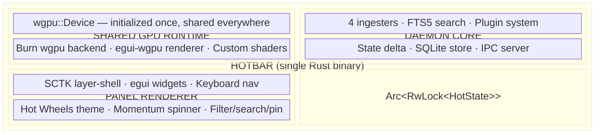
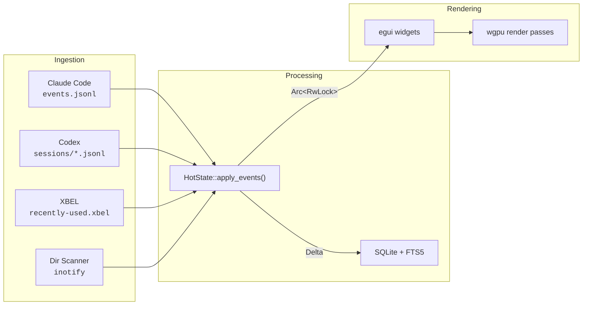

<!-- Link Reference Definitions — invisible metadata registry -->
[repo]: https://github.com/johnzfitch/hotbar
[license]: LICENSE
[build-badge]: https://img.shields.io/badge/build-passing-brightgreen
[test-badge]: https://img.shields.io/badge/tests-179%20passing-brightgreen
[license-badge]: https://img.shields.io/badge/license-MIT-blue
[egui]: https://github.com/emilk/egui
[wgpu]: https://wgpu.rs
[sctk]: https://github.com/Smithay/client-toolkit
[burn]: https://burn.dev
[rusqlite]: https://github.com/rusqlite/rusqlite

# HOTBAR

> <b>A <abbr title="Graphics Processing Unit">GPU</abbr>-accelerated file history timeline panel for Hyprland</b><br>
> Inspired by Hot Wheels Stunt Track Driver (<abbr title="THQ Inc.">THQ</abbr>/Mattel, 1998)

<table>
<tr>
<td><strong>Status</strong></td>
<td>Phase 4 Complete &mdash; <mark>179 tests passing</mark> &vert; GPU shaders pending</td>
</tr>
</table>

[![Build Status][build-badge]][repo]
[![Tests][test-badge]][repo]
[![License][license-badge]][license]

---

Vision
------

This is a **HOT**bar. Not a sidebar. Not a panel. Not a widget.

It&rsquo;s a file history timeline that runs hot&mdash;inspired by Hot Wheels Stunt Track Driver (THQ/Mattel, 1998). Files load into a vertical spinner like cars on a selection wheel. Heavy I/O makes the screen edges glow red-hot. Opening the panel triggers a flame burst. The whole thing screams speed because the code behind it *is* fast&mdash;single-binary Rust, <abbr title="Graphics Processing Unit">GPU</abbr>-accelerated particles, zero-copy state management, sub-16ms frame budget.

### What Makes It Different

<dl>
  <dt>Sub-10ms latency</dt>
  <dd>File changes appear in the spinner within 10ms of disk write</dd>

  <dt><abbr title="Graphics Processing Unit">GPU</abbr>-accelerated effects</dt>
  <dd>Flame particles, chrome surfaces, heat glow, starburst selection &mdash; <a href="https://wgpu.rs">wgpu</a> + custom <abbr title="WebGPU Shading Language">WGSL</abbr> shaders</dd>

  <dt>Four data sources</dt>
  <dd>Claude Code <code>events.jsonl</code>, Codex session logs, <abbr title="XML Bookmark Exchange Language">XBEL</abbr> recently-used, directory scanning</dd>

  <dt>Momentum physics</dt>
  <dd>Flick the spinner and watch it decelerate naturally &mdash; <var>angular_velocity</var> &times; 0.95 per frame</dd>

  <dt>Zero allocations per frame</dt>
  <dd>State is zero-copy, updates are deltas, path lookups via intern table</dd>

  <dt>Hot Wheels aesthetic</dt>
  <dd>Flame red, chrome silver, brushed metal, gradient text &mdash; nobody says &ldquo;oh, another dark mode panel&rdquo;</dd>
</dl>

---

Architecture
------------

<figure>



<figcaption><strong>Fig&nbsp;1</strong> &mdash; Single-binary architecture. The daemon and panel share state through an <code>Arc&lt;RwLock&gt;</code> and a single wgpu device drives all rendering.</figcaption>
</figure>

### Data Flow



### <abbr title="WebGPU Shading Language">WGSL</abbr> Shader Pipelines

Custom wgpu pipelines composite over egui output:

| Shader | Pipeline | Description |
|--------|----------|-------------|
| `flames.wgsl` | Compute &rarr; Render | Particle system driven by Burn tensor compute |
| `chrome.wgsl` | Fragment | Noise-based anisotropic brushed metal |
| `heat_glow.wgsl` | Fragment | Edge glow &mdash; hue interpolated by <var>activity_level</var> |
| `starburst.wgsl` | Fragment | Selection explosion, decays over ~0.3s |

---

Current Status
--------------

| Phase | Status | Tests | Description |
|:------|:------:|------:|:------------|
| **1: Foundation** | <mark>&check; Complete</mark> | 27 | Types, protocol, schema, database |
| **2: Daemon Core** | <mark>&check; Complete</mark> | 117 | 4 ingest sources, state delta, <abbr title="Inter-Process Communication">IPC</abbr> server |
| **3: Inference&nbsp;+&nbsp;Search** | <mark>&check; Complete</mark> | &mdash; | <abbr title="Full-Text Search 5">FTS5</abbr> search, ollama inference, plugin system, <abbr title="Graphics Processing Unit">GPU</abbr> device |
| **4: Panel UI** | <mark>&check; Complete</mark> | 35 | <abbr title="Smithay Client Toolkit">SCTK</abbr> shell, all egui widgets, keyboard nav |
| **5: Integration** | &hoarfr; Next | &mdash; | Wire daemon to panel, inotify watchers |
| **6: Polish** | &hoarfr; Pending | &mdash; | Performance tuning, bartender integration |

> [!NOTE]
> **<abbr title="Graphics Processing Unit">GPU</abbr> Shaders** are delegated to a GPU specialist (flames, chrome, heat_glow, starburst).

**Total:** <mark>179 tests passing</mark> &vert; 0 warnings &vert; 0 errors

---

Technology Stack
----------------

<table>
  <thead>
    <tr>
      <th>Layer</th>
      <th>Technology</th>
      <th>Version</th>
      <th>Purpose</th>
    </tr>
  </thead>
  <tbody>
    <tr>
      <td><strong>Language</strong></td>
      <td>Rust</td>
      <td>Edition 2024</td>
      <td>Zero-cost abstractions, memory safety</td>
    </tr>
    <tr>
      <td><strong><abbr title="Graphical User Interface">GUI</abbr> Framework</strong></td>
      <td><a href="https://github.com/emilk/egui">egui</a></td>
      <td>0.31</td>
      <td>Immediate-mode <abbr title="User Interface">UI</abbr> widgets</td>
    </tr>
    <tr>
      <td><strong>Wayland</strong></td>
      <td><a href="https://github.com/Smithay/client-toolkit">smithay-client-toolkit</a></td>
      <td>0.19</td>
      <td>Layer-shell surface management</td>
    </tr>
    <tr>
      <td><strong>Graphics</strong></td>
      <td><a href="https://wgpu.rs">wgpu</a></td>
      <td>24</td>
      <td>Vulkan/<abbr title="OpenGL">GL</abbr> backend for <abbr title="Graphics Processing Unit">GPU</abbr> shaders</td>
    </tr>
    <tr>
      <td><strong>Database</strong></td>
      <td><a href="https://github.com/rusqlite/rusqlite">rusqlite</a></td>
      <td>0.32</td>
      <td>SQLite with <abbr title="Full-Text Search 5">FTS5</abbr> full-text search</td>
    </tr>
    <tr>
      <td><strong>Async Runtime</strong></td>
      <td>tokio</td>
      <td>1.x</td>
      <td>Multi-source ingestion, <abbr title="Inter-Process Communication">IPC</abbr> server</td>
    </tr>
    <tr>
      <td><strong><abbr title="Machine Learning">ML</abbr> Inference</strong></td>
      <td><a href="https://burn.dev">Burn</a></td>
      <td>&mdash;</td>
      <td><abbr title="Open Neural Network Exchange">ONNX</abbr> model loader (Qwen2.5-Coder)</td>
    </tr>
    <tr>
      <td><strong>Serialization</strong></td>
      <td>serde + serde_json</td>
      <td>1.x</td>
      <td><abbr title="Inter-Process Communication">IPC</abbr> protocol, config files</td>
    </tr>
    <tr>
      <td><strong>Error Handling</strong></td>
      <td>thiserror</td>
      <td>2.x</td>
      <td>Typed error variants</td>
    </tr>
  </tbody>
</table>

---

Building
--------

### Prerequisites

```bash
# Arch Linux / Hyprland
sudo pacman -S rustup sqlite wayland vulkan-icd-loader

# Initialize Rust toolchain
rustup default stable
rustup component add clippy

# For GPU shader development
sudo pacman -S shaderc
```

### Build

```bash
# Clone
git clone https://github.com/johnzfitch/hotbar.git
cd hotbar

# Build (release)
cargo build --release

# Run tests
cargo test --workspace

# Run clippy
cargo clippy --all-targets -- -D warnings

# Binary output
./target/release/hotbar
```

### Development Build

```bash
# Fast incremental builds
cargo check

# Watch mode (requires cargo-watch)
cargo install cargo-watch
cargo watch -x check -x test
```

---

<details>
<summary><h2>Project Structure</h2></summary>

```
hotbar/
├── crates/
│   ├── hotbar-common/       # Shared types & protocol
│   │   ├── types.rs         # HotFile, Source, Action, Filter
│   │   ├── protocol.rs      # Command/Response IPC
│   │   ├── schema.rs        # SQL DDL, migrations
│   │   └── trace_db.rs      # SQLite tracing layer (spans + events)
│   │
│   ├── hotbar-daemon/       # Background daemon
│   │   ├── db.rs            # SQLite + FTS5
│   │   ├── state.rs         # HotState + ActivityTracker
│   │   ├── ipc.rs           # Unix socket IPC server
│   │   ├── search.rs        # FTS5 full-text search
│   │   ├── inference.rs     # LLM summarization (Burn/ollama)
│   │   ├── plugin.rs        # Plugin discovery + invocation
│   │   └── ingest/
│   │       ├── claude.rs    # Claude Code events.jsonl parser
│   │       ├── codex.rs     # Codex session JSONL parser
│   │       ├── xbel.rs      # XBEL recently-used parser
│   │       └── dirscan.rs   # Directory scanner
│   │
│   └── hotbar-panel/        # Wayland panel renderer
│       ├── gpu.rs           # Shared wgpu device
│       ├── sctk_shell.rs    # Layer-shell + event loop
│       ├── theme.rs         # Hot Wheels color tokens
│       ├── keybinds.rs      # Keyboard navigation
│       ├── app.rs           # Main UI coordinator
│       └── widgets/
│           ├── spinner.rs   # Momentum file spinner
│           ├── pit_stop.rs  # Pinned files shelf
│           ├── search_bar.rs # Debounced search
│           ├── context_menu.rs # Right-click menu
│           ├── toast.rs     # Toast notifications
│           ├── summary.rs   # Summary popover
│           ├── filter_bar.rs # Filter chips
│           └── logo.rs      # HOTBAR wordmark
│
├── tools/
│   ├── trace-viewer.sh      # Launcher script
│   └── trace-viewer.py      # DeltaGraph-inspired trace viewer (htmx)
│
├── CLAUDE.md                # Multi-agent development plan
├── README.md                # This file
└── Cargo.toml               # Workspace manifest
```

</details>

---

<details>
<summary><h2>Development Guide</h2></summary>

### Running Tests

```bash
# All tests
cargo test --workspace

# Specific crate
cargo test -p hotbar-daemon
cargo test -p hotbar-panel

# Specific test
cargo test --test integration_test

# With output
cargo test -- --nocapture
```

### Coding Standards

<dl>
  <dt>No <code>.unwrap()</code> outside <code>#[cfg(test)]</code></dt>
  <dd>Use <code>thiserror</code> for typed error variants</dd>

  <dt>All public items need <code>///</code> doc comments</dt>
  <dd>Enforced by clippy <code>missing_docs</code> lint</dd>

  <dt>Use <code>tracing::debug!</code> / <code>tracing::info!</code></dt>
  <dd>Never <code>println!</code> &mdash; all output goes through the tracing subscriber</dd>

  <dt>Edition 2024 features</dt>
  <dd>Use let-chains for nested conditions</dd>

  <dt>Zero-copy where possible</dt>
  <dd>Pass <code>&amp;[T]</code>, return <code>Vec&lt;&amp;T&gt;</code> for filters</dd>

  <dt>Test edge cases</dt>
  <dd>Multi-session timestamps, <abbr title="File Descriptor">FD</abbr> leaks, cursor persistence</dd>
</dl>

### Phase Gates (Pre-Merge Checklist)

All three must pass before merging:

```bash
cargo check --workspace
cargo clippy --all-targets -- -D warnings
cargo test --workspace
```

### Critical Edge Cases

> [!CAUTION]
> These bugs were found and fixed in the v1 TypeScript codebase. All five must be handled correctly in Rust.

**Multi-session timestamp bug** &mdash; `events.jsonl` accumulates across Claude Code sessions. Timestamps are relative to each session&rsquo;s start. Detect session boundaries (60s timestamp decrease), compute per-session <var>baseTime</var> anchored to file mtime.[^timestamps]

**Created action preservation** &mdash; First `Write()` = &ldquo;created&rdquo;, subsequent `Edit()` = &ldquo;modified&rdquo;. Use `createdPaths` HashSet to preserve &ldquo;created&rdquo; across session boundaries.[^created]

**<abbr title="File Descriptor">FD</abbr> exhaustion** &mdash; Close all directory handles. v1 leaked 166 <abbr title="File Descriptors">FDs</abbr>. Rust `ReadDir` auto-drops, but verify with `ls /proc/self/fd | wc -l` in integration tests.[^fdleak]

**Sandbox path filtering** &mdash; `events.jsonl` contains `/test/`, `/home/user/` sandbox paths. Only accept paths under `$HOME`.[^sandbox]

**Agent timestamp tolerance** &mdash; Dir scan uses 5s tolerance (<code>agent_ts &ge; mtime &minus; 5s</code>) to account for <var>baseTime</var> drift in relative timestamps.[^tolerance]

[^timestamps]: See `ingest/claude.rs` &mdash; session boundary detection at &gt;60s timestamp decrease, per-session baseTime anchored to file mtime.
[^created]: See `ingest/claude.rs` &mdash; `createdPaths: HashSet<PathBuf>` tracks first-write paths, post-processing restores &ldquo;created&rdquo; action.
[^fdleak]: v1 bug: `readdir()` enumerators held open across loop iterations. Caused icon theme loader to fail at 166 open FDs.
[^sandbox]: Claude Code&rsquo;s sandbox writes synthetic paths like `/test/path` and `/home/user/file` into the events log.
[^tolerance]: The 5-second window accounts for drift between Claude&rsquo;s relative timestamp math and actual filesystem mtime.

</details>

---

Trace Viewer
------------

Hotbar includes a built-in trace viewer for profiling and debugging. All `tracing` spans and events are written to a shared SQLite database at `~/.local/share/hotbar/traces.db` via a custom `tracing_subscriber::Layer`.

### Usage

```bash
# Launch the viewer (opens browser automatically)
./tools/trace-viewer.sh

# Or with options
python tools/trace-viewer.py --port 8777 --db path/to/traces.db
```

Then open `http://localhost:8777` in your browser.

<details>
<summary><strong>8 visualization views</strong></summary>

| View | Inspired&nbsp;By | What It Shows |
|:-----|:-----------------|:--------------|
| **Timeline** | <ruby>DeltaGraph<rp>(</rp><rt>1986</rt><rp>)</rp></ruby> | Hierarchical span tree with colored duration bars |
| **Events** | <ruby>DeltaGraph<rp>(</rp><rt>Notebook</rt><rp>)</rp></ruby> | Filterable log with level badges (<samp>DEBUG</samp> <samp>INFO</samp> <samp>WARN</samp> <samp>ERROR</samp>) |
| **Performance** | <ruby>DeltaGraph<rp>(</rp><rt>Bar Chart</rt><rp>)</rp></ruby> | Latency percentiles (P50/P90/P95/P99) + duration histogram |
| **Top Spans** | <ruby>DeltaGraph<rp>(</rp><rt>Notebook</rt><rp>)</rp></ruby> | Slowest 100 spans ranked by duration |
| **Heatmap** | <ruby>Lotus&nbsp;1-2-3<rp>(</rp><rt>1983</rt><rp>)</rp></ruby> | Spreadsheet grid (A&ndash;Z columns, numbered rows) with heat-colored cells |
| **Trend** | <ruby>Lotus&nbsp;1-2-3<rp>(</rp><rt>Line Chart</rt><rp>)</rp></ruby> | Frame-by-frame sparkline with 16ms budget threshold line |
| **Pie** | <ruby>Harvard&nbsp;Graphics<rp>(</rp><rt>1986</rt><rp>)</rp></ruby> | Conic-gradient pie chart with 3D shadow + proportional stacked bar |
| **Waterfall** | <ruby>Harvard&nbsp;Graphics<rp>(</rp><rt>Cascade</rt><rp>)</rp></ruby> | Gantt-like timeline showing span positions and nesting depth |

</details>

### How Tracing Works

Both `hotbar` (panel) and `hotbar-daemon` register a `trace_db::SqliteLayer` on startup:

```rust
let sqlite_layer = trace_db::init("panel")?;
tracing_subscriber::registry()
    .with(env_filter)
    .with(fmt_layer)
    .with(sqlite_layer)
    .init();
```

The layer captures every `tracing::debug_span!`, `tracing::info!`, etc. into three tables:

<dl>
  <dt><code>sessions</code></dt>
  <dd>One row per process startup &mdash; <var>pid</var>, <var>component</var>, <var>start_time</var></dd>

  <dt><code>spans</code></dt>
  <dd>One row per span close &mdash; name, target, level, start/end timestamps, fields</dd>

  <dt><code>events</code></dt>
  <dd>One row per tracing event &mdash; level, target, message, timestamp</dd>
</dl>

Data is batched (64 entries per flush), <abbr title="Write-Ahead Logging">WAL</abbr>-mode for concurrent access, and auto-pruned (&gt;30&nbsp;days) on startup.

---

Configuration
-------------

Config file: `$XDG_CONFIG_HOME/hotbar/config.toml`

```toml
[theme]
corner_radius = 6
panel_width = 420
panel_margin = 8

[keybinds]
rotate_up = "k"
rotate_down = "j"
open = "Enter"
search = "/"
pin = "p"

[inference]
backend = "ollama"  # "burn" | "ollama" | "none"
model = "qwen2.5-coder:1.5b"
ollama_url = "http://localhost:11434"
timeout_secs = 30

[plugins]
dir = "$XDG_CONFIG_HOME/hotbar/plugins"
timeout_ms = 5000
```

### Keyboard Navigation

<table>
  <thead>
    <tr><th>Key</th><th>Action</th></tr>
  </thead>
  <tbody>
    <tr><td><kbd>j</kbd> / <kbd>k</kbd></td><td>Rotate spinner down / up</td></tr>
    <tr><td><kbd>Enter</kbd></td><td>Open selected file</td></tr>
    <tr><td><kbd><kbd>Shift</kbd>+<kbd>Enter</kbd></kbd></td><td>Open containing folder</td></tr>
    <tr><td><kbd>/</kbd></td><td>Focus search bar</td></tr>
    <tr><td><kbd>p</kbd></td><td>Pin / unpin selected file</td></tr>
    <tr><td><kbd>Escape</kbd></td><td>Close panel or clear search</td></tr>
    <tr><td><kbd>1</kbd>&ndash;<kbd>5</kbd></td><td>Switch source filter</td></tr>
    <tr><td><kbd><kbd>Alt</kbd>+<kbd>Click</kbd></kbd></td><td>Summarize file (<abbr title="Large Language Model">LLM</abbr> inference)</td></tr>
  </tbody>
</table>

---

License
-------

<abbr title="Massachusetts Institute of Technology">MIT</abbr> License &mdash; see [LICENSE] for details.

---

Credits
-------

<dl>
  <dt><strong>Hot Wheels Stunt Track Driver</strong> <small>(THQ/Mattel, 1998)</small></dt>
  <dd>Visual aesthetic, spinner <abbr title="User Interface">UI</abbr> concept</dd>

  <dt><strong>Raycast</strong></dt>
  <dd>Command palette <abbr title="User Experience">UX</abbr> patterns</dd>

  <dt><strong>Linear</strong></dt>
  <dd>Polish, attention to detail</dd>

  <dt><strong>egui</strong></dt>
  <dd>Immediate-mode <abbr title="Graphical User Interface">GUI</abbr> paradigm</dd>
</dl>

<sub>Built with care and fire in Rust.</sub>
